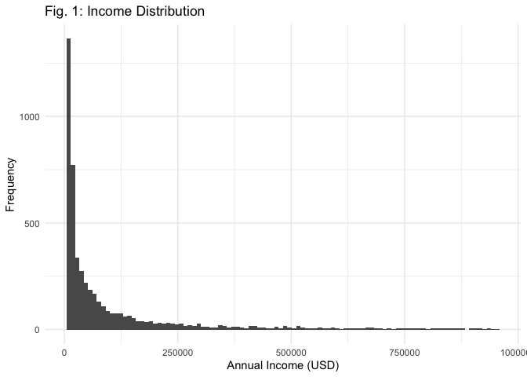
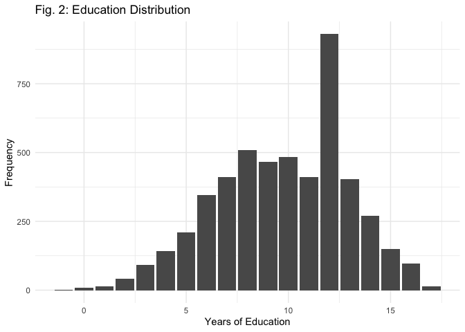
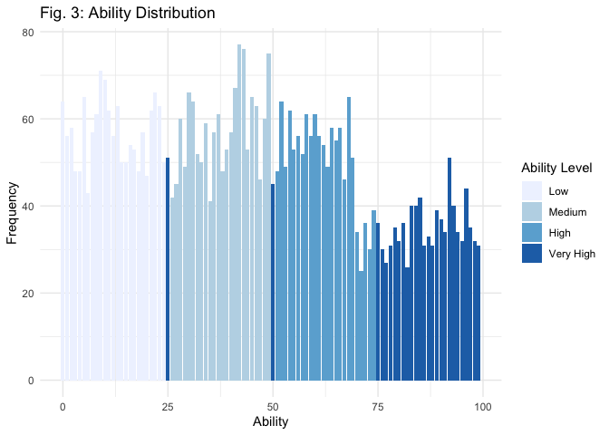
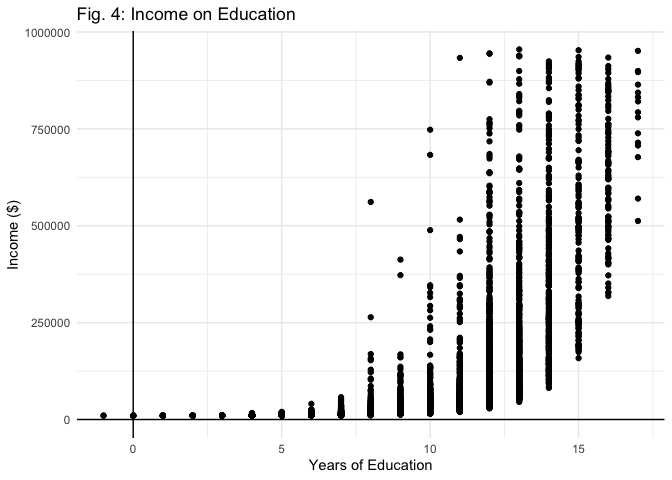
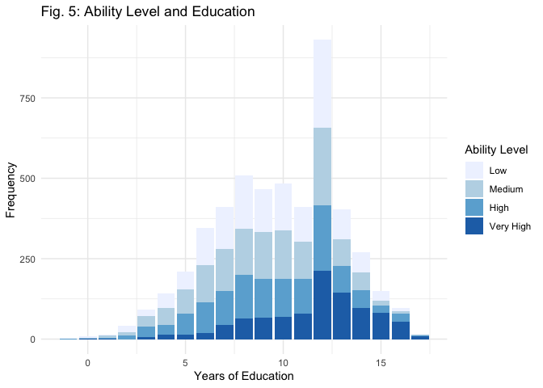
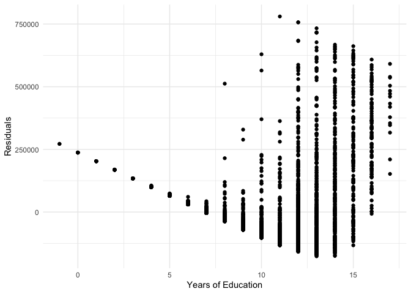

Econometrics Project
================
Lucas Marron & Zoë Arnaut
19 December 2021

## Mid-course project

``` r
## Load packages
library(pacman)
p_load(tidyverse, magrittr, readr, here, ggthemes, broom, stargazer, estimatr)
```

``` r
## Import the data
library(readr)
proj1 <- read_csv("proj1.csv")
```

    ## Rows: 5000 Columns: 8

    ## ── Column specification ────────────────────────────────────────────────────────
    ## Delimiter: ","
    ## dbl (8): income, married, kids, nonwhite, female, education, urban, ability

    ## 
    ## ℹ Use `spec()` to retrieve the full column specification for this data.
    ## ℹ Specify the column types or set `show_col_types = FALSE` to quiet this message.

``` r
## Preview the data
proj1 %>% head(10)
```

    ## # A tibble: 10 × 8
    ##     income married  kids nonwhite female education urban ability
    ##      <dbl>   <dbl> <dbl>    <dbl>  <dbl>     <dbl> <dbl>   <dbl>
    ##  1  54059.       0     0        1      1        12     0      94
    ##  2  22572.       0     0        1      0         9     1      45
    ##  3  10210.       0     0        0      0         4     0      19
    ##  4  10064.       0     2        1      1         3     1      21
    ##  5  10315.       1     2        1      1         5     0      60
    ##  6  12813.       1     1        1      1         8     1      88
    ##  7 159587.       1     1        1      0        12     1      81
    ##  8  38627.       0     0        1      0         9     1      40
    ##  9  63170.       1     1        1      1        12     0      89
    ## 10  13503.       0     2        1      1         6     0       5

### Questions

**Q01. Summarize and describe the dataset.**

  - This dataset contains demographic information, with 5000
    observations of 8 variables.
  - *Summary:* 52% of the sample is `female` and 62.52% is `non-white`.
  - *Figure 1 and 2:* The `income` distribution is skewed right, so in
    comparison, the `education` distribution looks relatively normal.
    There is a noticeable spike at 12 years of education.  
  - *Figure 3*: Overall, the `ability` distribution is skewed right
    slightly. More people are of “Low” (0-25), “Medium” (25-50), and
    “High” (50-75) ability levels, and fewer people are of “Very High”
    ability (75-100).
  - *Figure 4:* `income` and `education` very clearly have an
    exponential relationship and positive correlation. We used a scatter
    to better see how the variables relate to one another.  
  - *Figure 5:* `ability level` and `education` are slighlty positively
    correlated. People with higher levels of education also have higher
    levels of ability. We split `ability` into discrete bins to better
    visualize the data. Below 12 years of education, there is a fairly
    even distribution of people with “Low”, “Medium”, and “High” ability
    levels. At 12 years of education, all four categories are evenly
    represented. Above 12 years of education, the majority of people
    have a “Very High” ability level.

<!-- end list -->

``` r
## Summarize the data
summary(proj1)
```

    ##      income          married            kids           nonwhite     
    ##  Min.   : 10005   Min.   :0.0000   Min.   :0.0000   Min.   :0.0000  
    ##  1st Qu.: 13618   1st Qu.:0.0000   1st Qu.:0.0000   1st Qu.:0.0000  
    ##  Median : 34167   Median :0.0000   Median :0.0000   Median :1.0000  
    ##  Mean   :109837   Mean   :0.4978   Mean   :0.8192   Mean   :0.6252  
    ##  3rd Qu.:113070   3rd Qu.:1.0000   3rd Qu.:2.0000   3rd Qu.:1.0000  
    ##  Max.   :954977   Max.   :1.0000   Max.   :4.0000   Max.   :1.0000  
    ##      female       education          urban           ability  
    ##  Min.   :0.00   Min.   :-1.000   Min.   :0.0000   Min.   : 0  
    ##  1st Qu.:0.00   1st Qu.: 7.000   1st Qu.:0.0000   1st Qu.:22  
    ##  Median :1.00   Median :10.000   Median :0.0000   Median :44  
    ##  Mean   :0.52   Mean   : 9.756   Mean   :0.4954   Mean   :45  
    ##  3rd Qu.:1.00   3rd Qu.:12.000   3rd Qu.:1.0000   3rd Qu.:66  
    ##  Max.   :1.00   Max.   :17.000   Max.   :1.0000   Max.   :99

``` r
## Figure 1: Income Distribution
proj1 %>%
  ggplot() +
  geom_histogram(aes(x = income),
                 bins = 100) +
  labs(x = "Annual Income (USD)",
       y = "Frequency",
       title = "Fig. 1: Income Distribution") +
  theme_minimal()
```

<!-- -->

``` r
## Figure 2: Education Distribution
proj1 %>%
  ggplot() +
  geom_bar(aes(x = education)) +
  labs(x = "Years of Education",
       y = "Frequency",
       title = "Fig. 2: Education Distribution") +
  theme_minimal()
```

<!-- -->

``` r
## Figure 3: Ability Distribution

# Grouping ability into four categories
proj1 <-
  proj1%>%
  mutate(ability_level = ifelse(ability < 25, "Low", 
                                ifelse(ability > 25 & ability < 50, "Medium",
                                       ifelse(ability > 50 & ability < 75, "High",
                                              "Very High"))))

proj1$ability_level <- factor(proj1$ability_level, levels = c("Low", "Medium", "High", "Very High"))

proj1 %>%
  ggplot() +
  geom_bar(aes(x = ability,
               fill = ability_level)) +
  labs(x = "Ability",
       y = "Frequency",
       title = "Fig. 3: Ability Distribution") +
  scale_fill_brewer(name = "Ability Level",
                    palette = "Blues") +
  theme_minimal()
```

<!-- -->

``` r
## Figure 4: Income on Education
# Plot
proj1 %>%
  ggplot() +
  geom_point(aes(x = education, y = income)) +
  labs(title = "Fig. 4: Income on Education",
       x = "Years of Education",
       y = "Income ($)") +
  geom_vline(xintercept = 0) +
  geom_hline(yintercept = 0) +
  theme_minimal()
```

<!-- -->

``` r
## Figure 5: 
ggplot(data = proj1) +
  geom_bar(aes(x = education, 
               fill = ability_level)) +
  labs(title = "Fig. 5: Ability Level and Education",
       x = "Years of Education",
       y = "Frequency") +
  scale_fill_brewer(name = "Ability Level", 
                    palette = "Blues") +
  theme_minimal()
```

<!-- -->

**Q02. `reg1` - Regress individual’s `income` on an intercept and their
`education`.**

``` r
reg1 <- lm(income ~ education, data = proj1)
stargazer(reg1, type = "text")
```

    ## 
    ## ===============================================
    ##                         Dependent variable:    
    ##                     ---------------------------
    ##                               income           
    ## -----------------------------------------------
    ## education                  34,559.590***       
    ##                              (608.848)         
    ##                                                
    ## Constant                  -227,319.400***      
    ##                             (6,251.173)        
    ##                                                
    ## -----------------------------------------------
    ## Observations                   5,000           
    ## R2                             0.392           
    ## Adjusted R2                    0.392           
    ## Residual Std. Error   137,767.600 (df = 4998)  
    ## F Statistic         3,221.957*** (df = 1; 4998)
    ## ===============================================
    ## Note:               *p<0.1; **p<0.05; ***p<0.01

**Q03. Create a scatter plot with the residuals from `reg1` on y-axis
and `education` on the x-axis.**

``` r
reg1_residuals <- residuals(reg1)

proj1 %>%
  ggplot() +
  geom_point(aes(x = education,
                 y = reg1_residuals)) +
  labs(x = "Years of Education",
       y = "Residuals") +
  theme_minimal()
```

<!-- -->

**Q04. Does the scatter plot suggest that heteroskedasticity may be
present? Explain.**

Yes, the scatter plot suggests heteroskedasticity. As `education`
increases, so does the variance of the residuals. To check our
speculation, we ran a White Test against the null hypothesis
\(H_0:\alpha_1+\alpha_2=0\). Our White statistic was 1002.4668, with a
p-value of 2.075435e−218. We rejected the null hypothesis and concluded
that there is statistically significant evidence of heteroskedasticity,
since the p-value is almost zero.

``` r
## Running a White test

# square residuals
resid_sq <- reg1_residuals^2

# regress squared residuals on x's, squared x's, and interactions 
white_reg <- lm(resid_sq ~ education + I(education^2), 
            data = proj1)

# get r-squared
white_r2 <- summary(white_reg)$r.squared

# calc white-stat: LM = n x R^2
## n = 5000
white_stat <- 5000 * white_r2

# get p-value of white-stat
## df = # of slope parametes = 2
pchisq( q = white_stat, df = 2, lower.tail = FALSE)
```

    ## [1] 2.075435e-218

**Q05. Does the scatter plot suggest that there are any issues with your
specification?**

Yes, for three reasons. First, our residuals are not centered at 0,
which suggests a misspecification issue. Second, we saw earlier that the
income distribution is highly skewed right (Figure 1). Last, in Figure
4, we see a clear exponential relationship between education and income.
It would make sense that our specification is causing some of the
heteroskedasticity because we are fitting a linear model on an
exponential relationship.

**Q06. Explain why `reg1` could suffer from omitted-variable bias.**

`reg1` ikely suffers from omitted-variable because there are many
variables that affect income and are correlated with education
(e.g. gender, ability, work experience, or race).

**Q07. Give an example of an omitted variable (other than ability)**

`reg1` does not take into account `nonwhite`, which indicates if an
individual is white or a racial minority. This could cause
omitted-variable bias because race can affect `income` due of
discriminitory pay gaps and hiring processes. `nonwhite` is also
correlated with `education`, different racial groups have different
average years of education. Thus, `nonwhite` satifies the two
requirements of
OVB.

\[plim\hat{\beta_1} = \beta_1 + \beta_2 \frac{Cov(Nonwhite_i, Education_i)}{Var(Education_i)}\]

We would guess the bias is upward. `nonwhite` is likely negatively
correlated with `education` Cov(`nonwhite`, `education`), since there
are lower shares of racial minorities in higher education. We guess that
`nonwhite` is negatively correlated with `income` (\(\beta_2\)),
discrimitory pay gaps target racial minorities. Thus, the negatives
would cancel, and the bias would then be upward.

**Q08. Regress `income` on an intercept, `education`, and `ability`.
Interpret the
results.**

\[Regression \; Model: Income_i = \beta_0 + \beta_1Education_i +\beta_2Ability + u_i\]

  - The slope coefficient estimate on `education`, \(\hat \beta_1\),
    tells us that for each additional year of education, on average,
    income will increase by \(\$33,324\), holding `ability` constant.
  - The slope coefficient estimate on `ability`, \(\hat \beta_2\), tells
    us that for each additional increase in ability level, on average,
    income will increase by \(\$650\), holding `education` constant.
  - The intercept tells us that if one had \(0\) years of education and
    \(0\) ability, one’s income would be \(-\$244,530\). The intercept
    is not practically useful, though you could potentially interpret it
    as being in debt.  
  - All estimates are statistically significant, as evidenced by their
    small p-values.

<!-- end list -->

``` r
reg2 <- lm(income ~ education + ability, data = proj1)
stargazer(reg2, type = "text")
```

    ## 
    ## ===============================================
    ##                         Dependent variable:    
    ##                     ---------------------------
    ##                               income           
    ## -----------------------------------------------
    ## education                  33,324.970***       
    ##                              (619.306)         
    ##                                                
    ## ability                     650.066***         
    ##                              (72.034)          
    ##                                                
    ## Constant                  -244,530.100***      
    ##                             (6,488.086)        
    ##                                                
    ## -----------------------------------------------
    ## Observations                   5,000           
    ## R2                             0.402           
    ## Adjusted R2                    0.401           
    ## Residual Std. Error   136,672.200 (df = 4997)  
    ## F Statistic         1,677.627*** (df = 2; 4997)
    ## ===============================================
    ## Note:               *p<0.1; **p<0.05; ***p<0.01

**Q09. Does your estimate for the effect of education on income change
from `reg1` to `reg2`? Explain why this change (or lack of change) makes
sense.**

The slope coefficient on `education` is considerably lower on `reg2`
than `reg1`, though both estimates are statistically significant. It
seems that in `reg1`, a fair amount of the “education effect” is
actually due to ability. This makes sense because one’s income is likely
related to both education level and ability level. In addition, in
Figure 5, we showed that `ability` and `education` are positively
correlated.

To confirm our speculations are statistically significant we ran two
regressions: `income` on `ability` and `education` on `ability.` Both
regression estimates were statistically significant. So, `ability` did
cause omitted variable bias in `reg1`.

``` r
## education on ability
reg_education_ability <- lm(education ~ ability, data = proj1)
stargazer(reg_education_ability, type = "text")
```

    ## 
    ## ===============================================
    ##                         Dependent variable:    
    ##                     ---------------------------
    ##                              education         
    ## -----------------------------------------------
    ## ability                      0.026***          
    ##                               (0.002)          
    ##                                                
    ## Constant                     8.599***          
    ##                               (0.085)          
    ##                                                
    ## -----------------------------------------------
    ## Observations                   5,000           
    ## R2                             0.049           
    ## Adjusted R2                    0.049           
    ## Residual Std. Error      3.122 (df = 4998)     
    ## F Statistic          256.409*** (df = 1; 4998) 
    ## ===============================================
    ## Note:               *p<0.1; **p<0.05; ***p<0.01

``` r
## income on ability
reg_income_ability <- lm(income ~ ability, data = proj1)
stargazer(reg_income_ability, type = "text")
```

    ## 
    ## ===============================================
    ##                         Dependent variable:    
    ##                     ---------------------------
    ##                               income           
    ## -----------------------------------------------
    ## ability                    1,506.324***        
    ##                              (88.284)          
    ##                                                
    ## Constant                   42,047.000***       
    ##                             (4,656.710)        
    ##                                                
    ## -----------------------------------------------
    ## Observations                   5,000           
    ## R2                             0.055           
    ## Adjusted R2                    0.055           
    ## Residual Std. Error   171,747.400 (df = 4998)  
    ## F Statistic          291.120*** (df = 1; 4998) 
    ## ===============================================
    ## Note:               *p<0.1; **p<0.05; ***p<0.01

**Q10. Estimate three new models. Include a logarithmic transformation
and an interaction at least once (no repeats).**  
1.)\[education_i = \hat{\beta_0} + \hat{\beta_1}kids_i + e_i\]

``` r
## Model 1
reg3 <- lm(kids ~ education, data = proj1)
stargazer(reg3, type = "text")
```

    ## 
    ## ===============================================
    ##                         Dependent variable:    
    ##                     ---------------------------
    ##                                kids            
    ## -----------------------------------------------
    ## education                      0.004           
    ##                               (0.005)          
    ##                                                
    ## Constant                     0.783***          
    ##                               (0.053)          
    ##                                                
    ## -----------------------------------------------
    ## Observations                   5,000           
    ## R2                            0.0001           
    ## Adjusted R2                   -0.0001          
    ## Residual Std. Error      1.171 (df = 4998)     
    ## F Statistic            0.510 (df = 1; 4998)    
    ## ===============================================
    ## Note:               *p<0.1; **p<0.05; ***p<0.01

2.) \[log(income_i) = \hat{\beta_0} + \hat{\beta_1}nonwhite_i + e_i\]

``` r
## Model 2
reg4 <- lm(log(income) ~ nonwhite, data = proj1)
stargazer(reg4, type = "text")
```

    ## 
    ## ===============================================
    ##                         Dependent variable:    
    ##                     ---------------------------
    ##                             log(income)        
    ## -----------------------------------------------
    ## nonwhite                     -0.579***         
    ##                               (0.037)          
    ##                                                
    ## Constant                     11.065***         
    ##                               (0.029)          
    ##                                                
    ## -----------------------------------------------
    ## Observations                   5,000           
    ## R2                             0.048           
    ## Adjusted R2                    0.048           
    ## Residual Std. Error      1.251 (df = 4998)     
    ## F Statistic          251.509*** (df = 1; 4998) 
    ## ===============================================
    ## Note:               *p<0.1; **p<0.05; ***p<0.01

3.)
\[log(income_i) = \hat{\beta_0} + \hat{\beta_1}nonwhite_i + \hat{\beta_2}female_i + \hat{\beta_3}nowhite_i:female_i + e_i\]

``` r
##Model 3
reg5 <- lm(log(income) ~ female + nonwhite + female:nonwhite, data = proj1)
stargazer(reg5, type = "text")
```

    ## 
    ## ===============================================
    ##                         Dependent variable:    
    ##                     ---------------------------
    ##                             log(income)        
    ## -----------------------------------------------
    ## female                         0.095           
    ##                               (0.058)          
    ##                                                
    ## nonwhite                     -0.541***         
    ##                               (0.053)          
    ##                                                
    ## female:nonwhite               -0.072           
    ##                               (0.073)          
    ##                                                
    ## Constant                     11.014***         
    ##                               (0.042)          
    ##                                                
    ## -----------------------------------------------
    ## Observations                   5,000           
    ## R2                             0.048           
    ## Adjusted R2                    0.048           
    ## Residual Std. Error      1.250 (df = 4996)     
    ## F Statistic          84.838*** (df = 3; 4996)  
    ## ===============================================
    ## Note:               *p<0.1; **p<0.05; ***p<0.01

**Q11. How did you choose your specifications? Explain your decision
making.**

Regression 1: For this regression, we wanted to see if people with more
years of education are more or less likely to have kids. We kept a
linear model because any other specification would not make explanatory
sense.

Regression 2: For this regression, we wanted to see the effect of race
on income. We chose a log-linear specification. We did this because
income was heavily skewed right, and taking the log was an attempt to
decrease the spread of the data. In addition, we were interested in the
percent difference.

Regression 3: For this regression, we added gender to regression 2. We
thought that gender could be a possible omitted variable that could bias
the above regression. We added an interaction term to see if nonwhite
women faced an additional income discrimination.

**Q12. Which of your new models is “best” - if you must choose one
model, which would you choose? Why?**

The regression of log of income on nonwhite is our “best” model. Of our
regressions, this is the regression with the highest
f-statistic(251.509). At the 99% confidence level, we can reject the
null that race does not affect income. There is statistical evidence of
heteroskedasticity (as seen in our White test), so we will still need to
use heteroskedastic robust standard errors for hypothesis testing. But
even after calculating the new SEs, the coefficients are still
significant.

``` r
# get residuals and square
resid_sq_reg4 <- residuals(reg4)^2

#r egress squared residuals on x's, squared x's, and interactions 
white_reg4 <- lm(resid_sq_reg4 ~  nonwhite + I(nonwhite)^2 , data = proj1)

# get r-squared
white_r2_reg4 <- summary(white_reg4)$r.squared

# calc white-stat: LM = n x R^2
## n = 5000
white_stat_reg4 <- 5000 * white_r2_reg4

#get p-value of white-stat
## df = # of slope parameters = 2
pchisq( q = white_stat_reg4, df = 2, lower.tail = FALSE)
```

    ## [1] 0.01557159

``` r
lm_robust(log(income) ~ nonwhite, data = proj1, se_type = "HC2")
```

    ##              Estimate Std. Error   t value     Pr(>|t|)   CI Lower   CI Upper
    ## (Intercept) 11.064778  0.0297852 371.48581 0.000000e+00 11.0063861 11.1231702
    ## nonwhite    -0.579425  0.0369942 -15.66259 5.151175e-54 -0.6519499 -0.5069001
    ##               DF
    ## (Intercept) 4998
    ## nonwhite    4998

**Q13. For your “best” model, interpret the coefficients and comment on
their statistical significance.**

\(\hat{\beta_0}\): Given it is a log-linear function, the intercept has
no real meaning.

\(\hat{\beta_1}\): A person who is nonwhite will make 57.99% less in
income on average compared to somebody who is white.

**Q14. Do you trust the estimates from your best model? Explain why or
why not.**

We do trust the estimates from the model to an extent. First, the
estimates are distinguishable from 0. Even after using
heteroskedastic-robust errors, the coefficients were still significant.
Thus, we are confident that race and income have an inverse
relationship. However, we are unsure of the magnitude because we suspect
there is omitted variable bias. We tested gender in Model 3, and it came
up not significant. But, there are other possible omitted variables,
such as work experience which may cause bias. Many hiring processes tend
to be discriminatory towards racial minorities, and people with more
work experience are, for the most part, able to get more money for their
work. Thus, we predict the estimate is biased downwards.

**Q15. Suppose you want to estimate the effect of high-school
graduation. How could you use the current data to estimate this effect?
Describe any regressions, estimates, figures, and/or caveats you would
make.**  
*Assume someone with 12 years of education graduated from high school.*

We would use income to measure the monetary effect of high-school
graduation and run various regressions of `income` on `education` from
the data set. Essentially, we need to compare groups with no high school
diploma (`education` = 0 to 11) to groups with one (`education` = 12 and
above). However, one potential issue with this approach is the spread of
the data. As we saw in Figure 2 of the `education` distribution, there
is a much higher frequency of 12 years than other groups, so the sample
sizes of the tested groups are different, which could affect our
results. Still, to get a general idea of the high-school graduation
effect we ran a regression of \(log(income)\) on education and found
that on average a high school degree increases a person’s income by
$96,857.88.

``` r
-227319.400 + 34559.590*12
```

    ## [1] 187395.7

``` r
exp(11.481)
```

    ## [1] 96857.88

One issue with the above evaluation is that the model assumes the effect
of each additional year of education is constant. In reality, we would
not assume this to be true and would expect a large jump in income
between 11 and 12 years of education. Thus, we could run a regression of
`income` on `education` and `education`:`education` (the interaction of
education on itself). Then we would be able to see if the returns to
education increases or diminishes for each additional year of education.
By plotting the line, we can see if year 12 of education has a
noticeable increase.
